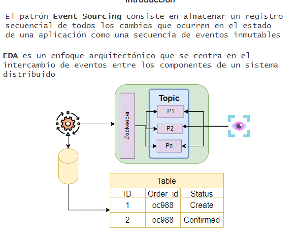
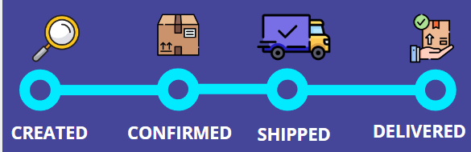
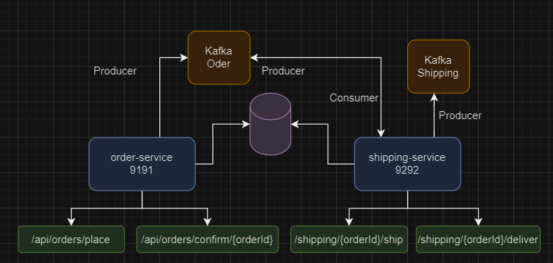
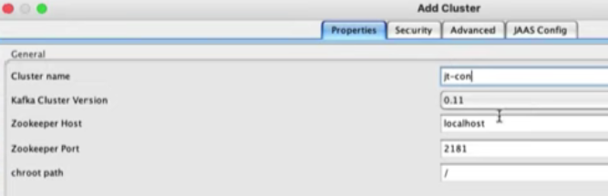
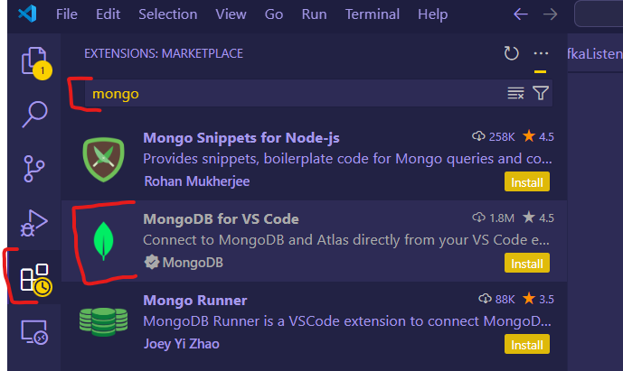

# Event-sourcing



## Contexto del Proyecto
Se busca actualizar el estatus (BD) y reflejar en tiempo real (Kafka) la actualización de la entrega de un paquete <br>
Al implementar Evens Sourcing se va a crear un nuevo registro de cada estatus en BD y Kafka



- Para todas las peticiones (nuevo estatus) se crea un nuevo registro en BD y se publica en el Topic **Oder** para que se vea en tiempo real los nuevos estados
- El micro servicio **Shipping** además publica en otro topic *Shipping* para notificar al area de paquetería



## Kafka
- Para ejecutar este proyecto se necesita tener levantado Kafka (puerto 9092) y Zookipeer. <br>
- Se puede ejecutar Kafka desde el siguiente proyecto: https://github.com/ErwinnerDev/kafka-installation-docker-JavaTechie <br>
- No es necesario crear los topic debido a que se crean automaticamnete. <br>

###  Kafka Monitoring
Para ver los registro del topic se puede usar **Offset Explore** <br>
https://www.kafkatool.com/download.html <br>



## Base de datos
- Para este proyecto se usa la BD de MongoDB (pero se puede usar cualquier otro si asi se requiete) <br>
- Se puede ejecura Mongo desde el siguente proyecto:
- https://github.com/ErwinnerDev/MongoDB-install-docker
- No es necesario crear un esquema o tabla, se creará automaticamente

###  Mongo Monitoring
Para ver los registros en la BD se puede instalar un plugin en Visual studio Code



## EndPont´s
Los endpoints son los siguientes:
```
Methos: Post
url: http://localhost:9191/api/orders/place
Body: 
{
    "name": "controles turb gamer",
    "qty": 1,
    "price": 900.00,
    "userId": "erw007"
}
Response body:
{
    "orderId": "fa9dbdd6",
    "status": "CREATED"
}
-------------------------------
Methos: Put
url: http://localhost:9191/api/orders/confirm/{orderId}
Body: N/A
Response body:
{
    "orderId": "fa9dbdd6",
    "status": "CONFIRMED"
}
-------------------------------
Methos: Post
url: http://localhost:9292/shipping/{orderId}/ship
Body: N/A
Response Post:
    Order shipped successfully.
    -------------------------------
Methos: Put
url: http://localhost:9292/shipping/{orderId}/deliver
Body: N/A
Response body:
    Order delivered successfully.
```

